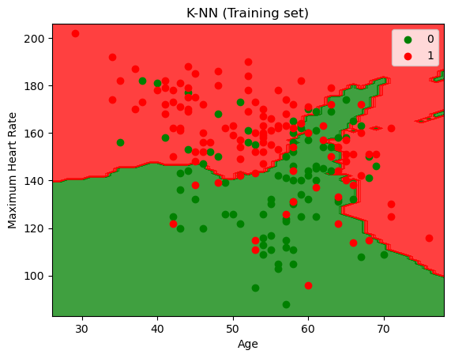
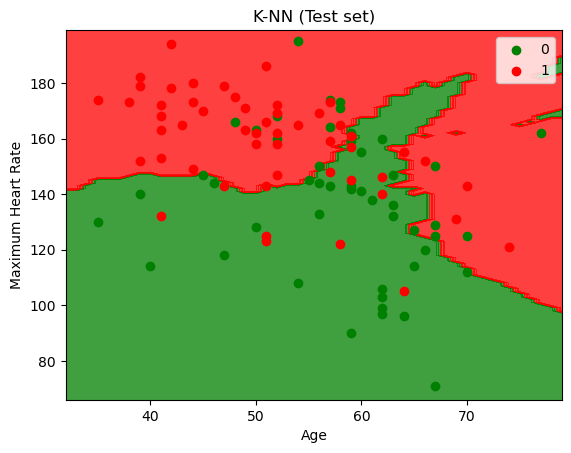
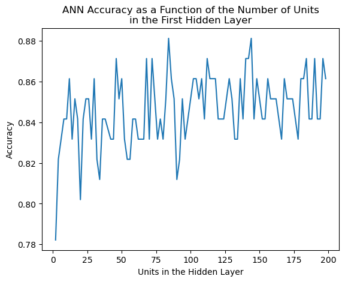
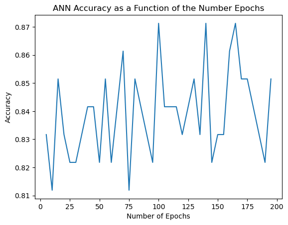

# Heart_Attack_Prediction_Models
Machine Learning Models for the Prediction of Myocardial Infraction Likelihood with Validations

### Index
1) Multiple Linear Regression
2) KNN Classification
3) Deap Learning with Artificial Neural Networks

### About the Project
This repository contains various machine learning models used to predict the likelihood of a myocardial infraction (MI) based on the following characteristics:
age, sex, chest pain (type), resting systolic blood pressure (bp), cholesterol, fasting blood sugar > 20 mg/dl (Y/N), resting ECG results, maximum heart rate, and exercise-induced angina (Y/N).
* The dataset includes observations for 303 patients, of which 138 suffered a MI.
* The mean age of the patients was 54, with a standard deviation of 9.08 years.
* The resting systolic bp was 131.63 mmHg, with a standard deviation of 17.57 mmHg.

This data was obtained from: https://www.kaggle.com/datasets/rashikrahmanpritom/heart-attack-analysis-prediction-dataset

### 1. Multiple Linear Regression
The first model for predicting the chances of a heart attack is a multiple linear regression model that takes into account all of the variables. The train/test split was set to 2:1. The trained model outputs a float between 0-1 corresponding to the probability of a heart attack.\
By rounding the predicted values up or down (<0.5 = 0 and >=0.5 = 1) we get the accuracy of the models predictions.\
**The accuracy obtained was <ins>82.2%</ins>**

One way to increase the accuracy in a clinical scenario would be to define a range of predicted values which would yield an "inconclusive" result. By setting the range of inconclusive y_pred values to >0.2 and <0.8 we can increase the accuracy to as much as **<ins>97%</ins>**.\
In this case 39 patients from the test set receive a prediction that is 97% accurate. However, this approach would exclude approx. 60% of patients from receiving MI risk assessment.

### 2. KNN Classification
A K-nearest neighbours classification was done considering the reliability of two of the variables in predicting the risk of myocardial infraction. From the dataset, the biggest risk factors for MI are age, high blood pressure, high cholesterol, and physical inactivity (assessed here by heart rate). By analysing the combination of two of these factors at a time, it was found that age and maximum heart rate provide the most accurate predictions when used to construct a KNN model. Nonetheless, the accuracy obtained was no sufficient to support the reliability of this approach. The model constructed uses the Minikowski metric with p=2 to apply Euclidean distances. The optimal nearest neighbours for this model was 18.\
**The accuracy obtained was <ins>72.3%</ins>**
 | 
:-------------------------:|:-------------------------:
*Visualisation of the KNN classification model for the training set*        |  *Visualisation of the KNN classification model for the training set*

### 3. Deep Learning with Artificial Neural Networks
An artificial neural network (ANN) was constructed using TensorFlow, taking into account all the variables. Initially, a neural network with a single hidden layer was considered. The ANN is of the Sequential class (TensorFlow, Keras) with a rectifier activation function for the hidden layer and a sigmoid activation function for the output layer, to allow for the assessment of the probability of the output. Initial tests were done to determine the optimal number of nodes in the hidden layer and the optimal number of epochs over which the model will be trained. The results are the following graphs:
 | 
:-------------------------:|:-------------------------:
*ANN accuracy over the number of nodes in the hidden layer*        |  *ANN accuracy over the number of epochs*
Optimal number of nodes in the hidden layer: **84**                |  Optimal number of epochs: **100**

Using the determined parameters, the ANN was compiled and trained. It was then evaluated using the test set.\
**The accuracy obtained was <ins>82.2%</ins>**

Similarly to the multiple linear regression model, the ANN was further evaluated by taking into account "inconclusive" values (>0.2 and <0.8). Using this approach, the accuracy of the model increased to **<ins>93.1%</ins>**.\
Although the accuracy is lower than in the multiple linear regression approach, the number of inconclusive results has dropped significantly from 62 to 24, thus increasing the number of patients who would be able to get a result to 76.2%, of which 11% would receive an incorrect risk assessment, compared to 8.3% in the multiple linear regression approach. Hence, the risks and benefits would have to be weighed to consider whether the benefit of being able to assess more patients (197.4%) is worth the decrease in accuracy.

