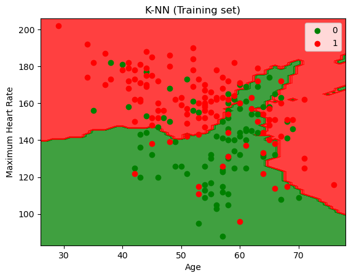

# Heart_Attack_Prediction_Models
## Machine Learning Models for the Prediction of Myocardial Infraction Likelihood with Validations

### About the Project
This repository contains various machine learning models used to predict the likelihood of a myocardial infraction (MI) based on the following characteristics:
age, sex, chest pain (type), resting systolic blood pressure (bp), cholesterol, fasting blood sugar > 20 mg/dl (Y/N), resting ECG results, maximum heart rate, and exercise-induced angina (Y/N).
* The dataset includes observations for 303 patients, of which 138 suffered a MI.
* The mean age of the patients was 54, with a standard deviation of 9.08 years.
* The resting systolic bp was 131.63 mmHg, with a standard deviation of 17.57 mmHg.

This data was obtained from: https://www.kaggle.com/datasets/rashikrahmanpritom/heart-attack-analysis-prediction-dataset

### 1. Multiple Linear Regression
The first model for predicting the chances of a heart attack is a multiple linear regression model that takes into account all of the variables. The train/test split was set to 2:1. The trained model outputs a float between 0-1 corresponding to the probability of a heart attack.\
By rounding the predicted values up or down (<0.5 = 0 and >=0.5 = 1) we get the accuracy of the models predictions.\
**The accuracy obtained was <ins>82.2%</ins>**

### 2. KNN Classification
A K-nearest neighbours classification was done considering the reliability of two of the variables in predicting the risk of myocardial infraction. From the dataset, the biggest risk factors for MI are age, high blood pressure, high cholesterol, and physical inactivity (assessed here by heart rate). By analysing the combination of two of these factors at a time, it was found that age and maximum heart rate provide the most accurate predictions when used to construct a KNN model. Nonetheless, the accuracy obtained was no sufficient to support the reliability of this approach. The model constructed uses the Minikowski metric with p=2 to apply Euclidean distances. The optimal nearest neighbours for this model was 18.\
**The accuracy obtained was <ins>72.3%</ins>**
 | 
:-------------------------:|:-------------------------:
*Visualisation of the KNN classification model for the training set*        |  *Visualisation of the KNN classification model for the training set*

